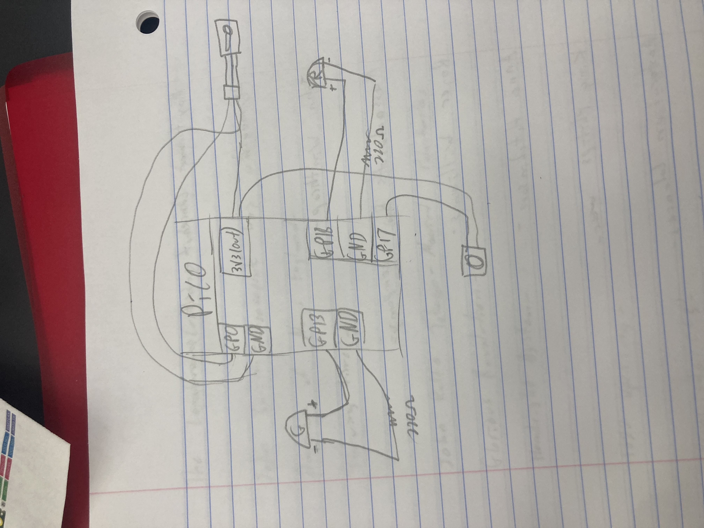
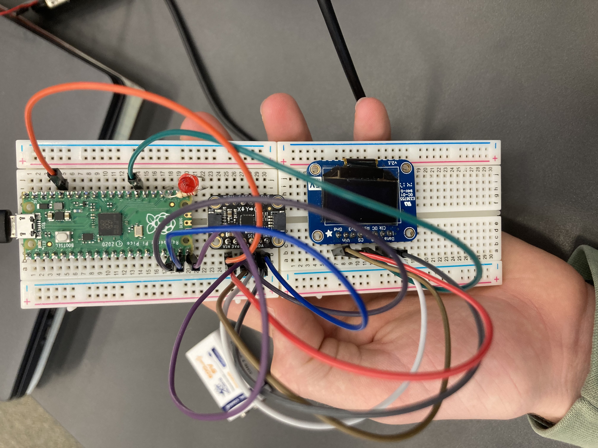
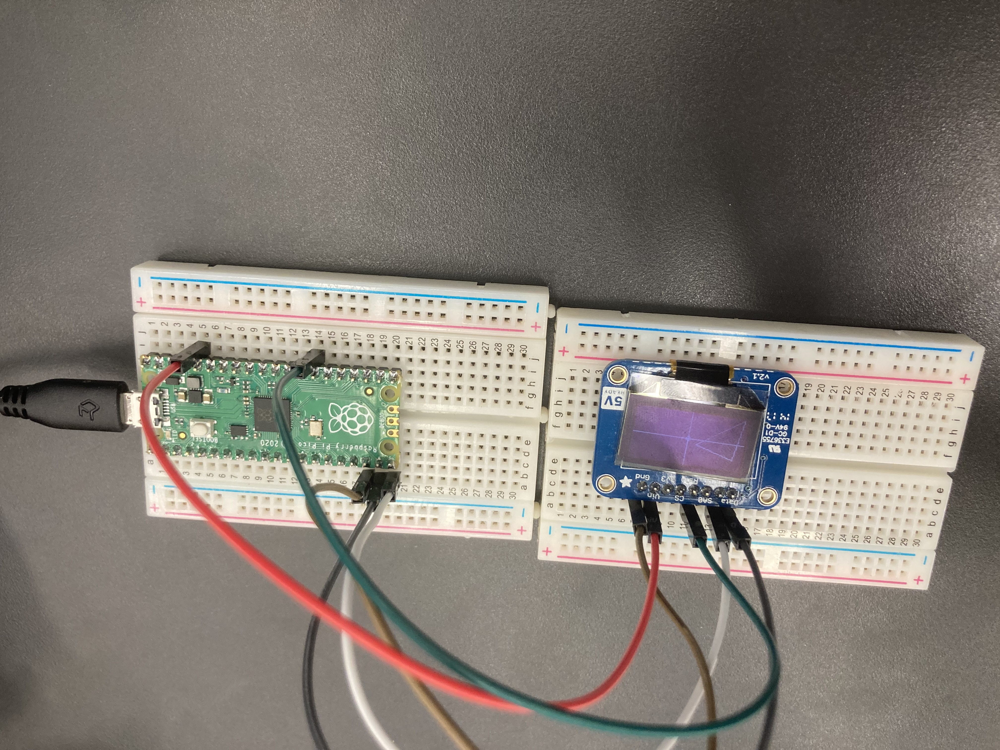
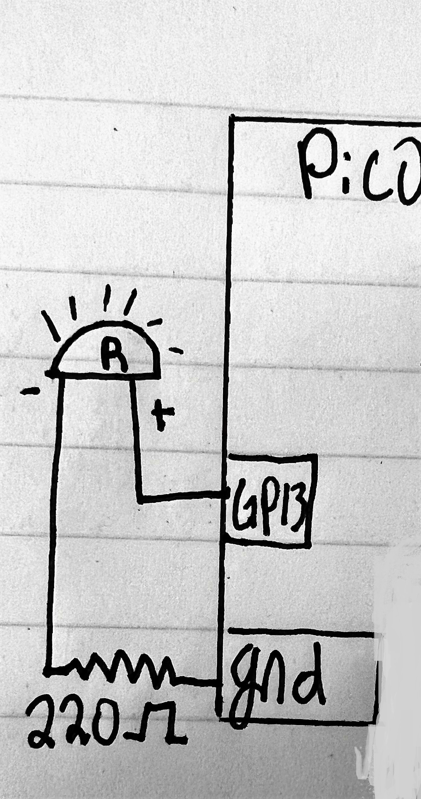

# Engineering_4_Notebook

&nbsp;

## Table of Contents
* [Launch_Pad_1](#Launch_Pad_1)
* [Launch_Pad_2](#Launch_Pad_2)
* [Launch_Pad_3](#Launch_Pad_3)
* [Launch_Pad_4](#Launch_Pad_4)
* [Crash_Avoidance_1](#Crash_Avoidance_1)
* [Crash_Avoidance_2](#Crash_Avoidance_2)
* [Crash_Avoidance_3](#Crash_Avoidance_3)
* [Landing_Area_1](#Landing_Area_1)
* [Landing_Area_2](#Landing_Area_2)
* [Morse_Code_1](#Morse_Code_1)
* [Morse_Code_2](#Morse_Code_2)
* [Onshape_Assignment_Template](#Onshape_Assignment_Template)

&nbsp;

## Launch_Pad_1

### Assignment Description

Create code to count down from 10 to 0 on the serial mointor. At 0, print the "Liftoff!" Use a loop and each number should be one second apart.

### Evidence 

https://user-images.githubusercontent.com/63983735/198157410-312b2911-d246-433e-bc82-131ca46b2963.mov

### Wiring

No wiring

### Code

``` python
# A countdown timer from 10-liftoff

import time 
import digitalio
import board 

led=digitalio.DigitalInOut(board.LED)
led.direction=digitalio.Direction.OUTPUT

for x in range(10, 0, -1): # This tells the function to count down from 10. The -1 means count down by one and the 0 means stop at 0. 
    print(x)                   #Count down in serial moniter
    time.sleep(1)

print("liftoff")
```

### Reflection

I didn't have a lot of trouble with this assignment. It was a good starting assignment for the new type of code. I was a little confused with the for loop, but I figured out that I needed to put the integer that you counted by at the end. 

&nbsp;

## Launch_Pad_2

### Assignment Description

Adding on to the assignment before, make a red LED blink everytime it counts down one second. Then turn on a green LED when it says "Liftoff!"

### Evidence 

https://user-images.githubusercontent.com/63983735/198157540-1b7d27db-2d23-466f-af0f-48d28da1be51.mov

### Wiring



### Code

``` python
import time
import board
import digitalio
led = digitalio.DigitalInOut(board.GP15)   #Set led and led2 to control both leds and make them do seperate things.
led.direction = digitalio.Direction.OUTPUT   #red led
led2 = digitalio.DigitalInOut(board.GP16)
led2.direction = digitalio.Direction.OUTPUT   #green led

#while True:
for i in range(10,0,-1):
    led.value = True
    time.sleep(.5)
    print(i)
    led.value = False
    time.sleep(.5)

print('LIFTOFF')
led2.value = True
```

### Reflection

I didn't have a lot of trouble on this assignment either. I realized that you have to make two different LED variables to make one blink at a different time than the other. I used Led and Led2.

&nbsp;

## Launch_Pad_3

### Assignment Description

We are adding on to the previous code. This time, you will use a button to initiate the countdown. You are still counting down to liftoff and the LEDs are blinking every second. 

### Evidence 

https://user-images.githubusercontent.com/63983735/198157735-de986317-83ba-4274-8708-b61aab024f3e.mov

### Wiring


### Code

This is the spicy version from Shrey because my code didn't get pushed correctly

``` python
import time
import board
import digitalio
led = digitalio.DigitalInOut(board.GP15)
led.direction = digitalio.Direction.OUTPUT
led2 = digitalio.DigitalInOut(board.GP16)
led2.direction = digitalio.Direction.OUTPUT
button = digitalio.DigitalInOut(board.GP11)
button.direction = digitalio.Direction.INPUT
button.pull = digitalio.Pull.UP      # Button is pulled up so when pressed will read as true

print('ready')

abortcheck = 0

while True:
    if not button.value:       #if button is pressed, initiate this function
        abortcheck = 1
        for i in range(10,0,-1):
            led.value = True
            print(i)
            time.sleep(.5)
            led.value = False
            if not button.value:
                print("ABORT")
                time.sleep(1)
                abortcheck = 0
                break
            time.sleep(.5)
        if abortcheck == 0:
            led2.value = False
        else:
            led2.value = True
            print("LIFTOFF")
```


### Reflection

This part was a little harder and I got help from Shrey. I was confused on pull and push code for the button. Once he explained it, it made a lot more sense. I needed "button.pull = digitalio.Pull.UP" instead of pull down. This makes sure that the code doesn't run before the button value is true. This is why we use a while true statement.

&nbsp;

## Launch_Pad_4

### Assignment Description

We are still building on the code from the previous assignments. In this assignment you need to move a servo 180 degress when the green light turns on and the serial monitor prints "Liftoff!"

### Evidence 

https://user-images.githubusercontent.com/63983735/198157804-bf16c9f3-f43b-47c4-bb21-4fcf63d7ba15.mov

### Wiring


### Code

``` python
import time
import board
import digitalio
import pwmio
from adafruit_motor import servo
led = digitalio.DigitalInOut(board.GP15)
led.direction = digitalio.Direction.OUTPUT
led2 = digitalio.DigitalInOut(board.GP16)
led2.direction = digitalio.Direction.OUTPUT
button = digitalio.DigitalInOut(board.GP11)
button.direction = digitalio.Direction.INPUT
button.pull = digitalio.Pull.UP
pwm_servo = pwmio.PWMOut(board.GP6, duty_cycle=2 ** 15, frequency=50)
servo1 = servo.Servo(pwm_servo, min_pulse=500, max_pulse=2500)
l = 0

servo1.angle=0     #tells angle that servo starts at
print('ready')

abortcheck = 0

while True:
    if not button.value:
        abortcheck = 1
        for i in range(10,0,-1):
            led.value = True
            print(i)
            time.sleep(.5)
            led.value = False
            time.sleep(.5)
            if i <= 3:         
                led.value = True
                #print(i)
                led.value = False
                servo1.angle = 60*(4-i)      #60 degree rotations for 3 times
                time.sleep(0.05)
            if not button.value:
                    print("ABORT")
                    time.sleep(1)
                    abortcheck = 0
                    break


        if abortcheck == 0:
            led2.value = False
        else:
            led2.value = True
            print("LIFTOFF")

```

### Reflection

This part was very easy. All you had to do was add as variable for the servo. Then you would make sure the code is running by printing "ready." You also needed to set the servo equal to 0 degress before you made it move by saying "servo1.angle=0." In the spicy version that Shrey did, he split up the movement of the servo into 3 sections of 60 degree rotations. 

&nbsp;

## Crash_Avoidance_1

### Assignment Description

Use an accelerometer to print the X, Y, and Z acceleration values. This should be in real time and countinuously print. 

### Evidence 

https://user-images.githubusercontent.com/63983735/198157965-b8bfef2b-3145-4d4d-8321-6f95b8f93800.mov

### Wiring



### Code

[This is my code](https://github.com/qragsda80/Engineering_4_Notebook/blob/main/raspberry-pi/CA1.py)

### Reflection

A very important thing to get out of this assignment is the use of f-strings. They can shorten your code by a lot and are very useful. We also were introduced to an accelerometer which I have never used before. It returns acceleration values wich will be useful in our pi in the sky projects.

&nbsp;

## Crash_Avoidance_2

### Assignment Description

The objective of this assigment is to add on to Crash Avoidance 1 and make an LED turn on when it turns past 90 degrees in any direction. We also need to power this by using a LiPo battery instead of the computer.

### Evidence 

https://user-images.githubusercontent.com/63983735/198158030-ad1dd5ff-8b01-41d7-bebb-5063d7477d45.mov

### Wiring


### Code
[This is my code](https://github.com/qragsda80/Engineering_4_Notebook/blob/main/raspberry-pi/CA2.py) 

### Reflection

This assignment was pretty simple. We added an if functions that said that if the value is less than or greater than 9 (which is around 90 degree), turn the LED on. This means I could turn the accelerometer in any direction on any axis and the LED would turn on if it gets close to 90 degrees. 

&nbsp;

## Crash_Avoidance_3

### Assignment Description

Wire an OLED screen that prints the angular velocity values. Keep the other parts of the assignment like the LiPo battery and the LED turning on when turned past 90 degrees in any direction.

### Evidence 


### Wiring


### Code
[This is my code](https://github.com/qragsda80/Engineering_4_Notebook/blob/main/raspberry-pi/CA3.py)

### Reflection

One challenging part of this assignment was learning how to make a splash function run over and over again and not just text on top of eachother. Have ( splash = displayio.Group()) before the code to print on the OLED screen in your while True: loop. Once You also had to change the code from acceleration to angular velocity, but that wasn't hard.

&nbsp;

## Landing_Area_1

### Assignment Description

Make code that will allow you to enter 3 coordinates of a triangle. Then it will return the area of the triangle to you.

### Evidence 

https://user-images.githubusercontent.com/63983735/198158356-7bf65323-b295-4371-82c7-9e00e29244bc.mov

### Wiring

No wiring

### Code
[This is my code](https://github.com/qragsda80/Engineering_4_Notebook/blob/main/raspberry-pi/LA1.py)

### Reflection

There was a going to be a lot of code in this assignment if it weren't for Elias Zell. He told me he found a really easy way to compress the code which was really helpful especially in the second assignment when you add more code. Learning the float function was helpful to convert the characters to number that the computer would understand. 

&nbsp;

## Landing_Area_2

### Assignment Description

Building on the last assignment, use an OLED screen to print everything. Also, you have to graph the triangle on the OLED screen.

### Evidence 

https://user-images.githubusercontent.com/63983735/198158356-7bf65323-b295-4371-82c7-9e00e29244bc.mov

### Wiring



### Code
[This is my code](https://github.com/qragsda80/Engineering_4_Notebook/blob/main/raspberry-pi/LA2.py)

### Reflection

This assignment was a lot simpler because of how I did the first assignment. I wired the OLED screen up and created axis lines for the graph. You had figure out how to make the graph correctly. I added 64 to the x-values and 32 to the y-values to make sure the points were in the right place. The 0,0 is in the corner of the OLED screen instead of the middle, so we had to change that. There was a circle function that I put on the origin and the triangle function which I used and put in the coordinate points.

&nbsp;

## Morse_Code_1

### Assignment Description

The objective of this assignment is to translate a few words into morse code. The code asks you for the word(s). You type it in, and the morse code is returned to you. There is a bigger amount of space in between letters and slashes in between different words.

### Evidence 

https://user-images.githubusercontent.com/63983735/198158584-17e3a748-1128-4bfb-bd6e-e12d76896160.mov

### Wiring

No wiring

### Code

``` python
import time
import board
import digitalio
led = digitalio.DigitalInOut(board.GP13)
led.direction = digitalio.Direction.OUTPUT
MORSE_CODE = { 'A':'.-', 'B':'-...',      #morse code dictionary
    'C':'-.-.', 'D':'-..', 'E':'.',
    'F':'..-.', 'G':'--.', 'H':'....',
    'I':'..', 'J':'.---', 'K':'-.-',
    'L':'.-..', 'M':'--', 'N':'-.',
    'O':'---', 'P':'.--.', 'Q':'--.-',
    'R':'.-.', 'S':'...', 'T':'-',
    'U':'..-', 'V':'...-', 'W':'.--',
    'X':'-..-', 'Y':'-.--', 'Z':'--..',
    '1':'.----', '2':'..---', '3':'...--',
    '4':'....-', '5':'.....', '6':'-....',
    '7':'--...', '8':'---..', '9':'----.',
    '0':'-----', ', ':'--..--', '.':'.-.-.-',
    '?':'..--..', '/':'-..-.', '-':'-....-',
    '(':'-.--.', ')':'-.--.-'}
modifier = 0.25
dot_time = 1*modifier
dash_time = 3*modifier
between_taps = 1*modifier
between_letters = 3*modifier
between_words = 7*modifier
list=[]
message = input("Enter message: ")
message=message.upper()       #Capitalization for message
final = ""
for letter in message:
    list.append(letter)
    if letter == " ":
        final = final + "/" + " "    #puts a slash and a space in between words

    else:
        final = final + MORSE_CODE[letter] + " "     #puts a spce in between letter in morse code
print (final)
```

### Reflection

 We used libraries for the first time in this assignment. It wwas nice that all of the morse code language was already done for us and we would just pull it from that. One part that I struggled on was figuring out how to space out the words in with the spaces and slashes, but I firgured out I had to count a space as a character. I said that "if letter == " "", you put a slash and a space at the end of it. If there is no space, you add a space on the end of the morse code letter by saying "final = final + MORSE_CODE[letter] + ' '"

&nbsp;

## Morse_Code_2

### Assignment Description

This assignment adds on to the previous, "Morse Code 1." In this assignment you have to wire an LED to blink accordingly with the morse code that is returned. There are short blinks for dots, long blinks for dashes, longer pauses in between letters, and even longer pauses in between words

### Evidence 

https://user-images.githubusercontent.com/63983735/198158753-2468a18c-96bf-4cf5-ab43-da9e89b4351b.mov

### Wiring



### Code

``` python

import time
import board
import digitalio
led = digitalio.DigitalInOut(board.GP13)
led.direction = digitalio.Direction.OUTPUT
MORSE_CODE = { 'A':'.-', 'B':'-...',
    'C':'-.-.', 'D':'-..', 'E':'.',
    'F':'..-.', 'G':'--.', 'H':'....',
    'I':'..', 'J':'.---', 'K':'-.-',
    'L':'.-..', 'M':'--', 'N':'-.',
    'O':'---', 'P':'.--.', 'Q':'--.-',
    'R':'.-.', 'S':'...', 'T':'-',
    'U':'..-', 'V':'...-', 'W':'.--',
    'X':'-..-', 'Y':'-.--', 'Z':'--..',
    '1':'.----', '2':'..---', '3':'...--',
    '4':'....-', '5':'.....', '6':'-....',
    '7':'--...', '8':'---..', '9':'----.',
    '0':'-----', ', ':'--..--', '.':'.-.-.-',
    '?':'..--..', '/':'-..-.', '-':'-....-',
    '(':'-.--.', ')':'-.--.-'}
modifier = 0.25
dot_time = 1*modifier
dash_time = 3*modifier
between_taps = 1*modifier
between_letters = 3*modifier
between_words = 7*modifier
list=[]
message = input("Enter message: ")
message=message.upper()
final = ""
for letter in message:
    list.append(letter)
    if letter == " ":
        final = final + "/" + " "

    else:
        final = final + MORSE_CODE[letter] + " " 
print (final)

for character in final:
    if character == ".":      #if character is a . turn led on for dot_time
        led.value = True
        time.sleep(dot_time)
    if character == "-":      #if character is a - turn led on for dash_time
        led.value = True
        time.sleep(dash_time)
    if character == "/":     #if character is a / turn off for between_words
        led.value = True
        time.sleep(between_words)
    if character == "":       #if there is no character, turn led off for between_letters
        led.value = True
        time.sleep(between_letters)
    led.value = False         
    time.sleep(between_taps)
```

### Reflection

It was a fun addition to the previous assignment.First we created a constant to multiply by when figuring out how much time we want in between each tap, letter, and word. This constant was called "modifier." It was .25 second long and we muliplied it by 1 for a dot, 3 for a dash, 1 for between taps, 3 for between letter, and 7 for between words. Then we made a lot of if statements for each character that you would see to translate that to the LED. I showed my parents this assignment and they thought it was very useful in the real world.

&nbsp;


## Shoutout to Shrey Panicker and Elias Zell for their contributions to this Notebook. It couldn't have been done without out you two... ;)
All wiring diagrams are originally theirs. Check them out on Github [@shrey45](https://github.com/shrey45/Engineering_4_Notebook) and [ezell38](https://github.com/ezell38/Engineering_4_Notebook)!


## Onshape_Assignment_Template

### Assignment Description

Write your assignment description here. What is the purpose of this assignment? It should be at least a few sentences.

### Part Link 

[Create a link to your Onshape document](https://cvilleschools.onshape.com/documents/003e413cee57f7ccccaa15c2/w/ea71050bb283bf3bf088c96c/e/c85ae532263d3b551e1795d0?renderMode=0&uiState=62d9b9d7883c4f335ec42021). Don't forget to turn on link sharing in your Onshape document so that others can see it. 

### Part Image

Take a nice screenshot of your Onshape document. 

### Reflection

What went wrong / was challenging, how'd you figure it out, and what did you learn from that experience? Your goal for the reflection is to pass on knowledge that will make this assignment better or easier for the next person. Think about your audience for this one, which may be "future you" (when you realize you need some of this code in three months), me, or your college admission committee!

&nbsp;

## Media Test

Your readme will have various images and gifs on it. Upload a test image and test gif to make sure you've got the process figured out. Pick whatever image and gif you want!

### Test Link

[Hyperlink text](http://crossdivisions.com)

### Test Image


### Test GIF


## FEA Part 1 (Beam Design)

### Assignment Description

Write your assignment description here. What is the purpose of this assignment? It should be at least a few sentences.

### Part Link 

[Create a link to your Onshape document](https://cvilleschools.onshape.com/documents/003e413cee57f7ccccaa15c2/w/ea71050bb283bf3bf088c96c/e/c85ae532263d3b551e1795d0?renderMode=0&uiState=62d9b9d7883c4f335ec42021). Don't forget to turn on link sharing in your Onshape document so that others can see it. 

### Part Image

Take a nice screenshot of your Onshape document. 

### Reflection

What went wrong / was challenging, how'd you figure it out, and what did you learn from that experience? Your goal for the reflection is to pass on knowledge that will make this assignment better or easier for the next person. Think about your audience for this one, which may be "future you" (when you realize you need some of this code in three months), me, or your college admission committee!


## FEA Part 2 (Simscale Workflow)

### Assignment Description

Write your assignment description here. What is the purpose of this assignment? It should be at least a few sentences.

### Part Link 

[Create a link to your Onshape document](https://cvilleschools.onshape.com/documents/003e413cee57f7ccccaa15c2/w/ea71050bb283bf3bf088c96c/e/c85ae532263d3b551e1795d0?renderMode=0&uiState=62d9b9d7883c4f335ec42021). Don't forget to turn on link sharing in your Onshape document so that others can see it. 

### Part Image

Take a nice screenshot of your Onshape document. 

### Reflection

What went wrong / was challenging, how'd you figure it out, and what did you learn from that experience? Your goal for the reflection is to pass on knowledge that will make this assignment better or easier for the next person. Think about your audience for this one, which may be "future you" (when you realize you need some of this code in three months), me, or your college admission committee!


## FEA Part 3 (Iterative Design)

### Assignment Description

Write your assignment description here. What is the purpose of this assignment? It should be at least a few sentences.

### Part Link 

[Create a link to your Onshape document](https://cvilleschools.onshape.com/documents/003e413cee57f7ccccaa15c2/w/ea71050bb283bf3bf088c96c/e/c85ae532263d3b551e1795d0?renderMode=0&uiState=62d9b9d7883c4f335ec42021). Don't forget to turn on link sharing in your Onshape document so that others can see it. 

### Part Image

Take a nice screenshot of your Onshape document. 

### Reflection

What went wrong / was challenging, how'd you figure it out, and what did you learn from that experience? Your goal for the reflection is to pass on knowledge that will make this assignment better or easier for the next person. Think about your audience for this one, which may be "future you" (when you realize you need some of this code in three months), me, or your college admission committee!


## 4.1 Ring and Spinner

### Assignment Description

Write your assignment description here. What is the purpose of this assignment? It should be at least a few sentences.

### Part Link 

[Create a link to your Onshape document](https://cvilleschools.onshape.com/documents/003e413cee57f7ccccaa15c2/w/ea71050bb283bf3bf088c96c/e/c85ae532263d3b551e1795d0?renderMode=0&uiState=62d9b9d7883c4f335ec42021). Don't forget to turn on link sharing in your Onshape document so that others can see it. 

### Part Image

Take a nice screenshot of your Onshape document. 

### Reflection

What went wrong / was challenging, how'd you figure it out, and what did you learn from that experience? Your goal for the reflection is to pass on knowledge that will make this assignment better or easier for the next person. Think about your audience for this one, which may be "future you" (when you realize you need some of this code in three months), me, or your college admission committee!


## 4.2 Key and Prop

### Assignment Description

Write your assignment description here. What is the purpose of this assignment? It should be at least a few sentences.

### Part Link 

[Create a link to your Onshape document](https://cvilleschools.onshape.com/documents/003e413cee57f7ccccaa15c2/w/ea71050bb283bf3bf088c96c/e/c85ae532263d3b551e1795d0?renderMode=0&uiState=62d9b9d7883c4f335ec42021). Don't forget to turn on link sharing in your Onshape document so that others can see it. 

### Part Image

Take a nice screenshot of your Onshape document. 

### Reflection

What went wrong / was challenging, how'd you figure it out, and what did you learn from that experience? Your goal for the reflection is to pass on knowledge that will make this assignment better or easier for the next person. Think about your audience for this one, which may be "future you" (when you realize you need some of this code in three months), me, or your college admission committee!


## 4.3 Assembling the Launcher

### Assignment Description

Write your assignment description here. What is the purpose of this assignment? It should be at least a few sentences.

### Part Link 

[Create a link to your Onshape document](https://cvilleschools.onshape.com/documents/003e413cee57f7ccccaa15c2/w/ea71050bb283bf3bf088c96c/e/c85ae532263d3b551e1795d0?renderMode=0&uiState=62d9b9d7883c4f335ec42021). Don't forget to turn on link sharing in your Onshape document so that others can see it. 

### Part Image

Take a nice screenshot of your Onshape document. 

### Reflection

What went wrong / was challenging, how'd you figure it out, and what did you learn from that experience? Your goal for the reflection is to pass on knowledge that will make this assignment better or easier for the next person. Think about your audience for this one, which may be "future you" (when you realize you need some of this code in three months), me, or your college admission committee!
